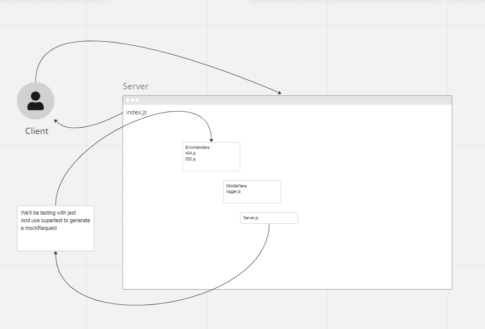

# LAB - Class 01

## Project: server-deployment-practice

### Author: Rafael Aldana

### Problem Domain

API where we practice coding middleware and deployment.

### Links and Resources

- [GitHub Actions ci/cd](https://github.com/Rafael-Aldana/server-deployment-practice/actions)
- [back-end server dev url](https://server-deployment-practice-dev-0ptx.onrender.com)
- [back-end server prod url](https://server-deployment-practice-prod-uh9b.onrender.com)

### Setup

#### `.env` requirements (where applicable)

for now I have none and do not require one

#### How to initialize/run your application (where applicable)

- e.g. `npm start`

#### How to use your library (where applicable)

#### Features / Routes

- Feature One: deploy Dev

#### Tests

- How do you run tests? npm test
- Any tests of note? N/A
- Describe any tests that you did not complete, skipped, etc

#### UML

